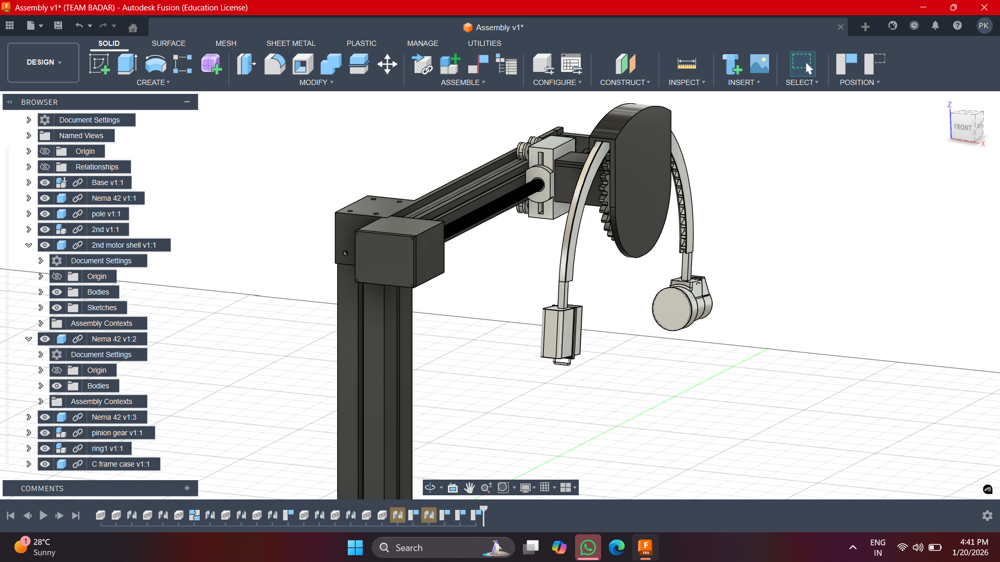

# 3-DOF C-Arm Robotic System for Medical Scanning Applications

This repository presents the design, kinematic modeling, and motion planning of a
**3-degree-of-freedom (3-DOF) C-Arm robotic system** developed for controlled scanning
and imaging applications.

The system is designed to replicate the essential motion of medical C-Arm scanners
using a mechanically simple and repeatable architecture.

---

## System Configuration

The robot implements **three controlled degrees of freedom**:

### Degrees of Freedom
1. **Prismatic Joint (Horizontal Translation)**  
   Linear motion along the base using a linear rail and lead screw mechanism to
   position the vertical column.

2. **Prismatic Joint (Vertical Translation)**  
   Vertical movement of the column to adjust scanning height and cover different
   sections of the object.

3. **Revolute Joint (C-Arm Rotation)**  
   Rotational motion of the C-Arm structure around the object using a
   **pinion–spur gear mechanism**, enabling multi-angle scanning.

This **2P–1R configuration** provides wide workspace coverage while maintaining
mechanical simplicity and repeatable motion.

---

## Mechanical Design

The complete mechanical assembly was designed in **Fusion 360** and exported in
**STEP format** for cross-platform compatibility.

<p align="center">
  
</p>

<p align="center">
  
</p>

<p align="center"><i>Mechanical assembly of the 3-DOF C-Arm robot</i></p>

---

## Repository Structure

```
CAD/
├── C_Arm.step/
Complete mechanical assembly (STEP format)

Kinematics/
├── dh_parameters.md          
├── forward_kinematics.py
└── scan_trajectory.py
DH-based kinematic modeling and scan trajectory generation

Control/
├── motion_logic.md
└── scan_sequence_pseudocode.md
Motion control strategy, safety constraints, and scan execution flow    
```

---

## Kinematic Modeling

- The robot structure is modeled using the **Denavit–Hartenberg (DH) convention**
- Two prismatic joints and one revolute joint are defined
- Forward kinematics is implemented in **Python** to compute the C-Arm position
- Kinematic parameters are derived from the physical dimensions of the CAD model

---

## Motion Planning and Control Logic

- User-defined scan parameters (linear range, rotation range, step size)
- Synchronized execution of linear translation and rotational scanning
- Software-defined joint limits to prevent over-travel
- Homing and repeatable scan execution logic


---

## Motion Demonstration

The animation below shows coordinated linear positioning and rotational scanning
of the C-Arm structure.

<p align="center">
  
</p>

<p align="center"><i>Simulated scanning motion of the 3-DOF C-Arm robot</i></p>

---

## Tools Used

- **Autodesk Fusion 360** - Mechanical design
- **Python (NumPy)** - Kinematic modeling and trajectory planning
- **Markdown** - Technical documentation
- **Git & GitHub** - Version control and project presentation

---

## Project Status

- Mechanical design complete
- Kinematic modeling and validation complete
- Motion planning and control logic documented


---

## Future Work

- ROS-based visualization
- Add Gazebo Simulation
- Implement closed-loop motor control
- Extend simulation to real hardware deployment


## Contributing

Contributions are welcome! Please feel free to submit issues and pull requests.

## Author

kaushikurwa

## Acknowledgments

- ROS 2 community
- Gazebo simulation platform


